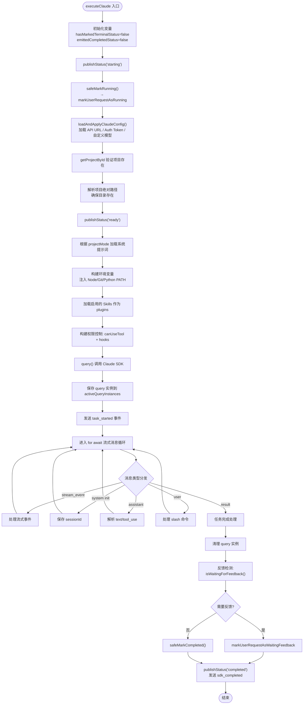
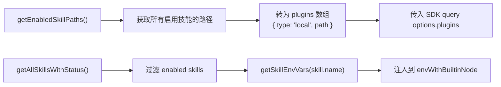
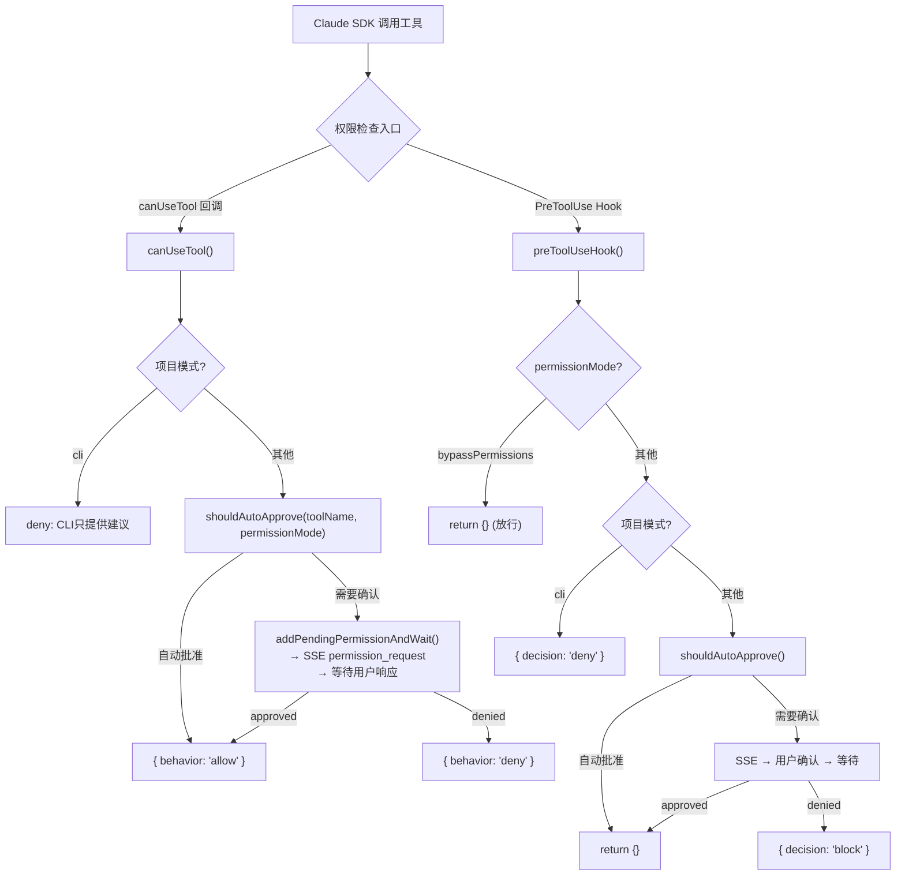
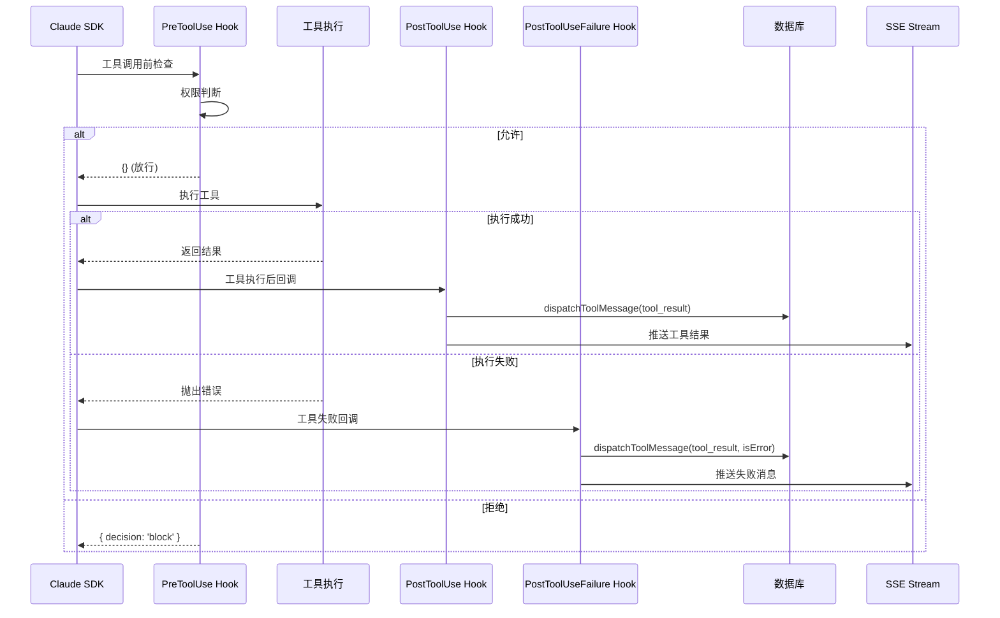
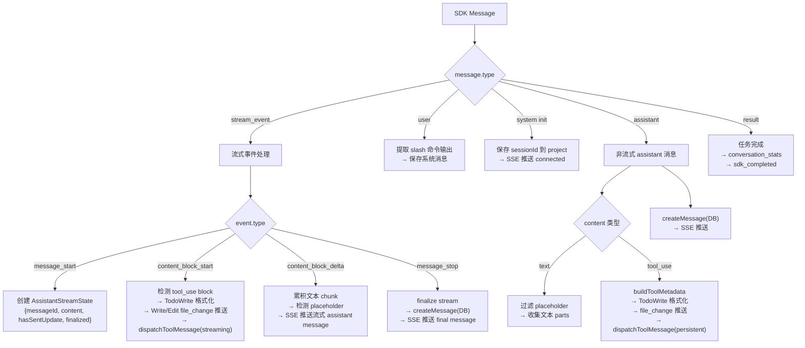
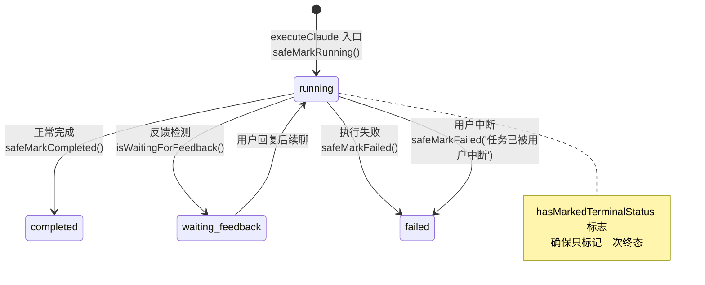
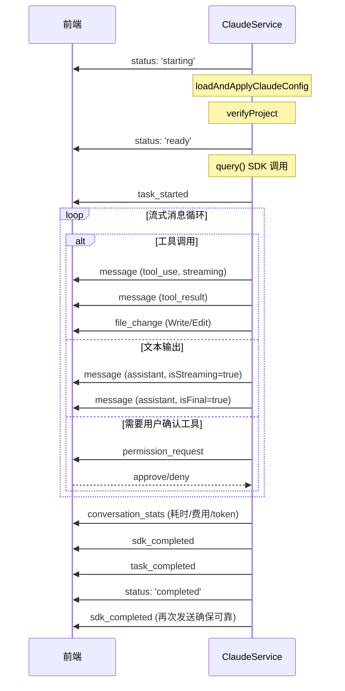
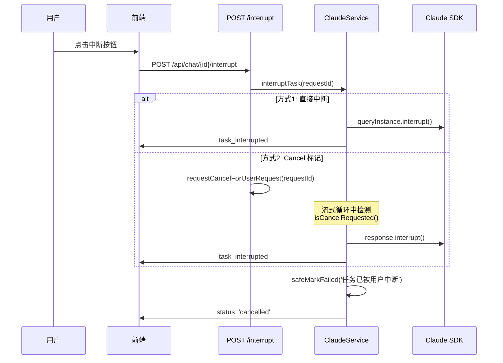
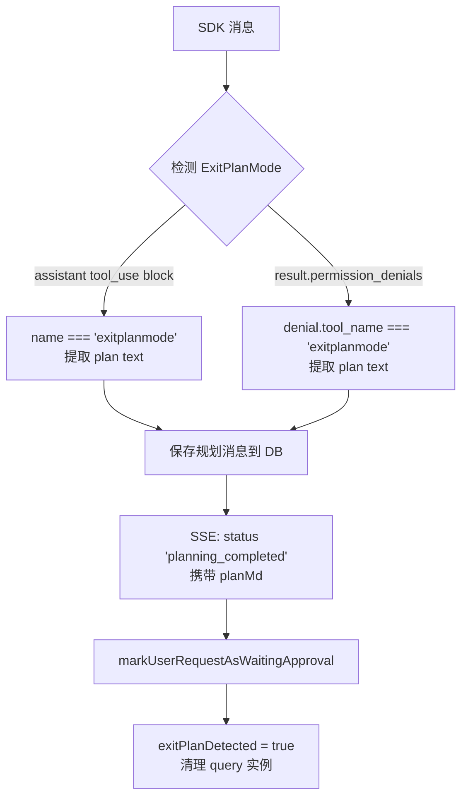
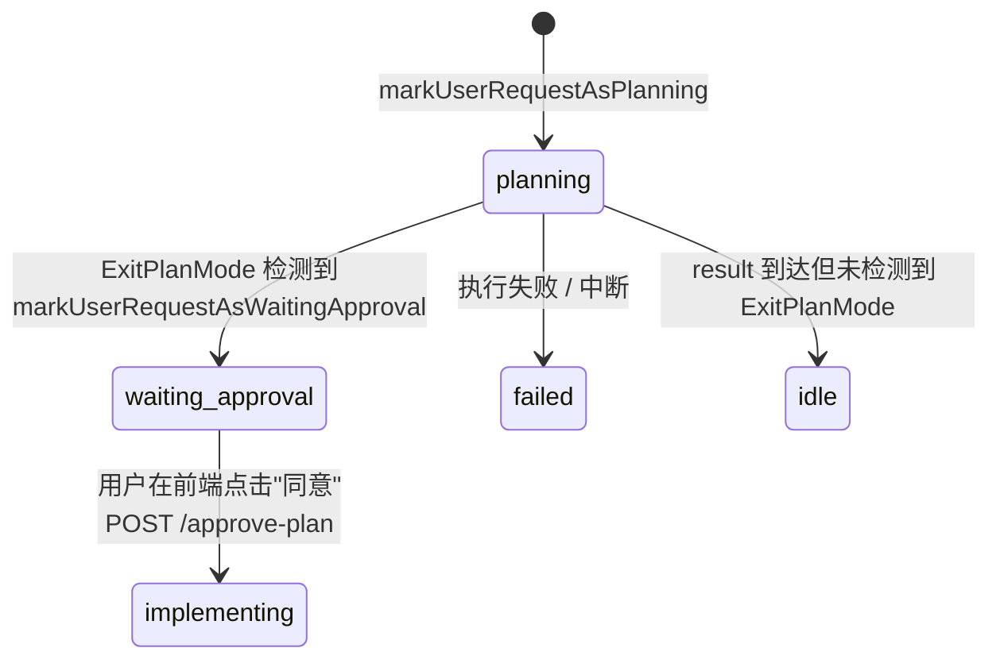

# Claude Service 执行流程详解

**文件**: `lib/services/cli/claude.ts` (2859 行)

---

## 1. 导出函数概览

| 函数 | 用途 | 调用场景 |
|------|------|----------|
| `executeClaude()` | 核心执行函数 (L701-2263) | 被其他函数内部调用 |
| `initializeNextJsProject()` | 项目初始化 (L2274-2325) | isInitialPrompt=true, code mode |
| `applyChanges()` | 应用变更 (L2337-2347) | 后续对话消息 |
| `generatePlan()` | 规划模式 (L2349-2796) | Claude + code mode + planConfirmed=false |
| `interruptTask()` | 中断任务 (L2801-2858) | 用户点击中断按钮 |

---

## 2. executeClaude() 核心执行流程



### 2.1 详细阶段说明

#### Phase 1: 配置加载 (L641-689)
`loadAndApplyClaudeConfig()`:
- 从 GlobalSettings 读取 `cli_settings.claude`
- 设置 `ANTHROPIC_BASE_URL` (默认 `https://api.100agent.co`)
- 设置 `ANTHROPIC_AUTH_TOKEN`
- 返回 `customModel` (用于第三方兼容 API)

#### Phase 2: 系统提示词选择 (L906-965)

| 模式 | 提示词来源 | 说明 |
|------|-----------|------|
| `work` | `buildExecutionSystemPrompt(workDir, basePrompt)` | 员工 system_prompt 或 work-mode prompt + 删除限制 |
| `boss` | 员工 system_prompt 或 boss-mode prompt | 直接使用，无文件操作前缀 |
| `cli` | 员工 system_prompt 或 cli-mode prompt | 只提供命令行建议 |
| `code` (nextjs) | `getExecutionSystemPrompt('nextjs', path)` | Next.js 项目专用 |
| `code` (python) | `getExecutionSystemPrompt('python-fastapi', path)` | FastAPI 项目专用 |

#### Phase 3: 环境准备 (L978-1055)

```
PATH 注入顺序:
  1. 内置 Node.js (node-runtime/darwin-arm64/bin)
  2. 内置 Python (python-runtime/darwin-arm64/bin)
  3. 内置 Git (git/cmd + git/usr/bin + git/bin)
  4. 原始 PATH

环境变量注入:
  - GOODABLE_API_BASE = http://localhost:{port}
  - AI 服务环境变量 (从 global settings)
  - 各启用 Skill 的环境变量
```

#### Phase 4: SDK 调用 (L1329-1376)

```typescript
query({
  prompt: instruction,
  options: {
    cwd: absoluteProjectPath,
    additionalDirectories: [absoluteProjectPath],
    model: finalModel,
    resume: sessionId,              // 续聊
    permissionMode,                 // 权限模式
    systemPrompt: systemPromptText,
    maxOutputTokens,
    pathToClaudeCodeExecutable,
    env: envWithBuiltinNode,
    plugins,                        // Skill 插件数组
    allowedTools,                   // 有插件时: ['Skill', 'Bash', 'Read', 'Write', 'Edit', 'Glob', 'Grep']
    canUseTool,                     // 权限回调
    hooks,                          // PreToolUse / PostToolUse / PostToolUseFailure
    stderr,                         // stderr 回调
  }
})
```

---

## 3. Skill (插件) 加载与调用

### 3.1 Skill 加载 (L1033-1060)



- Skills 通过 `skill-service` 模块管理
- 每个 Skill 是一个本地目录，包含 MCP 配置
- 启用的 Skills 路径列表传入 SDK 的 `plugins` 参数
- 有插件时，`allowedTools` 设为 `['Skill', 'Bash', 'Read', 'Write', 'Edit', 'Glob', 'Grep']`
- 有插件时，`settingSources` 设为 `['project']`

### 3.2 Skill 环境变量注入

每个启用的 Skill 可能有自己的环境变量 (API keys 等):
```typescript
for (const skill of enabledSkills) {
  const skillEnv = await getSkillEnvVars(skill.name);
  Object.assign(envWithBuiltinNode, skillEnv);
}
```

---

## 4. Tool 调用过程

### 4.1 权限控制架构



### 4.2 权限模式

| 模式 | 说明 | PreToolUse | canUseTool |
|------|------|-----------|------------|
| `bypassPermissions` | 全放行 | 直接 return {} | 不注册 (undefined) |
| `default` | 默认模式 | 自动批准常用工具，其他需确认 | 同左 |
| `cli` | CLI 建议模式 | 拒绝所有工具 | 拒绝所有工具 |

### 4.3 Hook 系统

三个 Hook 按执行时序：



#### PreToolUse (L1110-1189)
- 权限拦截：bypass 直接放行，cli 直接拒绝
- 自动审批: `shouldAutoApprove(toolName, permissionMode)`
- 需确认时: 创建 PendingPermission → SSE 推送 `permission_request` → Promise 等待用户响应

#### PostToolUse (L1192-1247)
- 记录工具执行结果 (truncate 到 2000 字符)
- 持久化 `tool_result` 消息到 DB + SSE
- 去重 key: `post_${toolUseID}`

#### PostToolUseFailure (L1250-1298)
- 记录工具执行失败
- 持久化带 `isError: true` 的 `tool_result` 消息
- 去重 key: `fail_${toolUseID}`

---

## 5. 流式消息处理

### 5.1 消息类型分发 (L1409-2058)

`for await (const message of response)` 循环处理的消息类型：



### 5.2 流式 vs 非流式 assistant 消息

| 路径 | 来源 | 持久化 | 场景 |
|------|------|--------|------|
| `stream_event` → `content_block_delta` → `message_stop` | 实时流 | `message_stop` 时持久化 | SDK 启用 streaming |
| `message.type === 'assistant'` | 完整消息 | 立即持久化 | SDK 批量返回 |

### 5.3 工具消息处理特殊逻辑

**TodoWrite 检测** (L1494-1534, L1891-1932):
- 检测 `todowrite` / `todo_write` 工具
- 格式化 todo 列表 (🔄/⏳/✅ 图标)
- 流式和非流式各处理一次

**Write/Edit file_change** (L1537-1559, L1935-1957):
- 检测文件写入/编辑工具
- 推送 `file_change` SSE 事件
- 携带 filePath、content / oldString / newString

**Tool Placeholder 去重** (L785-799):
- `placeholderHistory`: 按 sessionKey 记录已处理的 placeholder
- `persistedToolMessageSignatures`: 按 signature 去重持久化的 tool 消息
- 避免同一工具操作产生重复消息

---

## 6. 状态变化过程

### 6.1 UserRequest 状态流转



### 6.2 SSE 事件发布时序



### 6.3 中断流程



### 6.4 错误处理分类 (L2141-2262)

| 错误类型 | 检测条件 | 处理 |
|----------|---------|------|
| 用户中断 | `aborted` / `Request was aborted` | `task_interrupted` + 抛出 |
| CLI 未安装 | `command not found` / `not found: claude` | 友好提示安装指令 |
| 认证失败 | `not authenticated` | 提示 `claude auth login` |
| 权限错误 | `permission` / `EACCES` | 提示检查目录权限 |
| Token 超限 | `max_tokens` | 提示缩短 prompt |
| 网络错误 | stderr 含 `network` / `ENOTFOUND` | 检查网络连接 |
| 会话丢失 | `No conversation found` | 清除 sessionId，提示重新发送 |
| 模型错误 | stderr 含 `model` / `unsupported` | 提示更换模型 |

---

## 7. generatePlan() 规划模式

### 7.1 与 executeClaude 的关键区别

| 对比项 | executeClaude | generatePlan |
|--------|-------------|--------------|
| SDK permissionMode | 项目配置 | `'plan'` (只读) |
| maxOutputTokens | 4000 (默认) | 2000 (默认) |
| hooks | PreToolUse + PostToolUse + PostToolUseFailure | 无 |
| canUseTool | 有 (权限控制) | 无 |
| plugins (Skills) | 有 | 无 |
| 关注事件 | assistant / tool_use / result | assistant + `ExitPlanMode` tool_use |

### 7.2 规划完成检测



### 7.3 规划状态流转



---

## 8. 全局状态管理

### 8.1 activeQueryInstances

```typescript
const activeQueryInstances = new Map<string, Query>();
```

- **存入**: SDK `query()` 调用后，`requestId → response`
- **用途**: 中断任务时通过 `queryInstance.interrupt()` 中断 SDK
- **清理**: 任务完成 / 失败 / 中断时删除

### 8.2 关键 Ref 标志

| 标志 | 类型 | 作用 |
|------|------|------|
| `hasMarkedTerminalStatus` | boolean | 防止重复标记终态 (completed/failed) |
| `emittedCompletedStatus` | boolean | 防止重复发送 completed 状态 |
| `hasAnnouncedInterrupt` | boolean | 防止重复发送中断事件 |
| `exitPlanDetected` | boolean | (规划模式) 防止 ExitPlanMode 重复处理 |
| `placeholderHistory` | Map<string, Set> | placeholder 去重 |
| `persistedToolMessageSignatures` | Set<string> | 持久化 tool 消息去重 |
| `assistantStreamStates` | Map<string, State> | 流式 assistant 消息状态跟踪 |
| `completedStreamSessions` | Set<string> | 已完成的流式 session 跟踪 |
