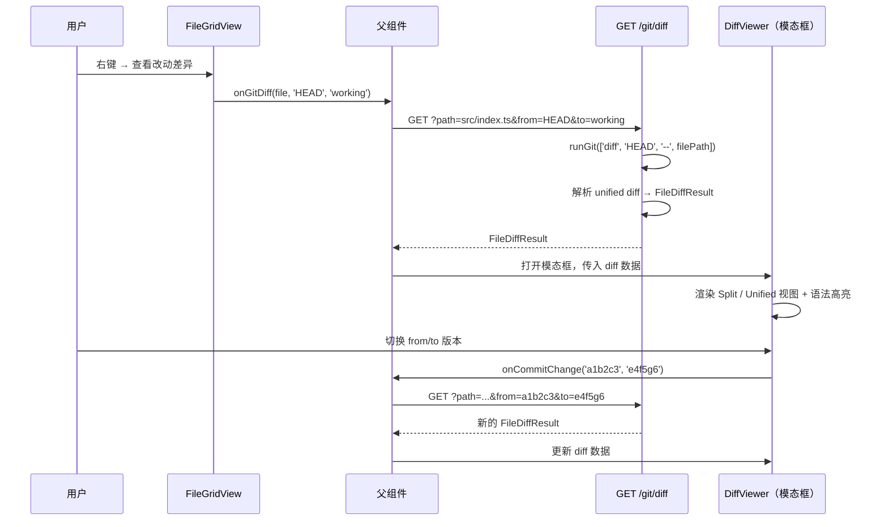
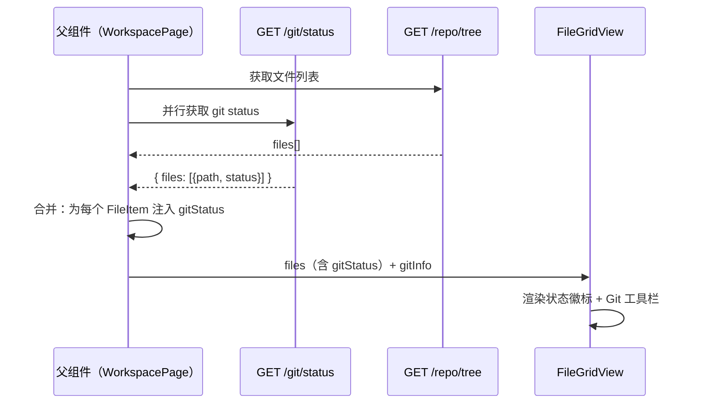
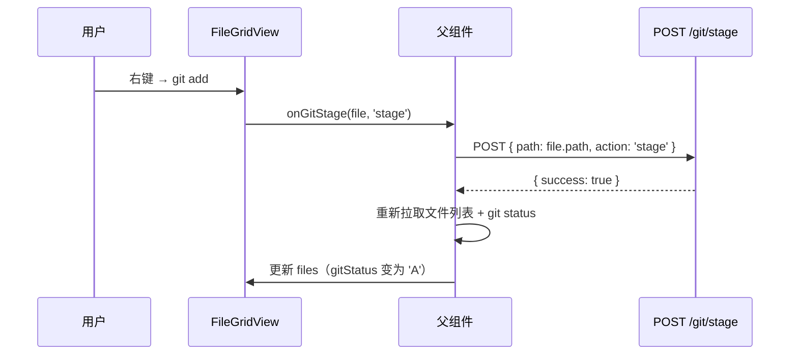
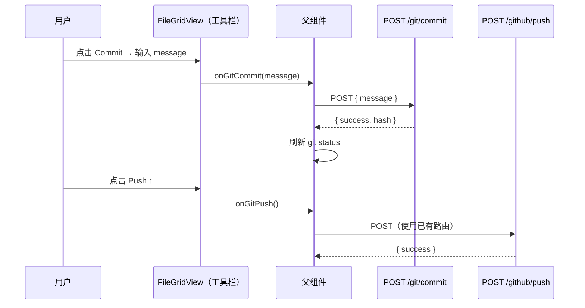

# FileGridView Git 集成设计方案

**涉及文件**：`components/files/FileGridView.tsx`

---

## 1. 现有能力基线

### 1.1 文件操作层（已有）

| 层级 | 文件 | 已有能力 |
|------|------|---------|
| 底层 Git | `lib/services/git.ts` | `ensureGitRepository` / `commitAll` / `pushToRemote` / `addOrUpdateRemote` / `ensureGitConfig` |
| GitHub 集成 | `lib/services/github.ts` | `connectProjectToGitHub` / `pushProjectToGitHub` / `createRepository` |
| 文件 API | `app/api/repo/[project_id]/files/route.ts` | mkdir / createFile / delete / rename / move / copy / upload |
| GitHub API | `app/api/projects/[project_id]/github/connect` | 创建并连接仓库 |
| GitHub API | `app/api/projects/[project_id]/github/push` | 推送到远端 |

### 1.2 缺失能力（需新增）

- `git status --porcelain` 查询工作区文件变更状态
- `git add <path>` 单文件暂存
- `git restore <path>` 单文件丢弃改动
- `git diff <path>` 文件差异内容
- `git diff <commitA> <commitB> -- <path>` 历史版本间差异
- `git show <hash>:<path>` 指定版本文件内容
- `git log` 提交历史
- `git branch` 分支查询与切换
- 对应的 API 路由层封装
- **差异对比面板**（DiffViewer 组件）

---

## 2. 整体架构

```
┌─────────────────────────────────────────────────┐
│                FileGridView (UI)                 │
│                                                  │
│  ┌──────────┐  ┌───────────┐  ┌───────────────┐ │
│  │ 文件图标  │  │ ContextMenu│  │  Git 工具栏   │ │
│  │ +状态徽标 │  │ +Git 操作  │  │(分支/提交/推送)│ │
│  └──────────┘  └───────────┘  └───────────────┘ │
└────────────────────┬────────────────────────────┘
                     │ fetch
        ┌────────────▼────────────────────┐
        │    新增 API 路由层               │
        │  GET  /api/repo/:id/git/status   │
        │  POST /api/repo/:id/git/commit   │
        │  POST /api/repo/:id/git/stage    │
        │  GET  /api/repo/:id/git/log      │
        │  GET  /api/repo/:id/git/branches │
        │  POST /api/repo/:id/git/checkout │
        │  GET  /api/repo/:id/git/diff     │  ← 新增
        └────────────┬────────────────────┘
                     │ 调用
        ┌────────────▼────────────────────┐
        │    lib/services/git.ts（扩展）   │
        │  + getGitStatus()               │
        │  + gitStage() / gitRestore()    │
        │  + getGitDiff()                 │  ← 新增
        │  + getGitFileDiff()             │  ← 新增
        │  + getGitLog()                  │
        │  + getCurrentBranch()           │
        │  + listBranches()               │
        │  + checkoutBranch()             │
        └─────────────────────────────────┘
```

---

## 3. 数据层设计

### 3.1 扩展 lib/services/git.ts

新增 6 个导出函数：

```typescript
/**
 * 获取工作区文件变更状态
 * 调用: git status --porcelain
 * 返回: Map<相对路径, GitFileStatus>
 */
export function getGitStatus(repoPath: string): Map<string, GitFileStatus>

/**
 * 文件级暂存/还原
 * gitStage:   git add <filePath>
 * gitRestore: git restore <filePath>（丢弃工作区改动）
 * gitRestoreStaged: git restore --staged <filePath>（取消暂存）
 */
export function gitStage(repoPath: string, filePath: string): void
export function gitRestore(repoPath: string, filePath: string): void
export function gitRestoreStaged(repoPath: string, filePath: string): void

/**
 * 获取工作区文件与 HEAD 的差异（unified diff 格式）
 * 调用: git diff HEAD -- <filePath>
 * staged=true 时: git diff --cached HEAD -- <filePath>
 */
export function getGitFileDiff(
  repoPath: string,
  filePath: string,
  staged?: boolean
): string

/**
 * 获取两个 commit/分支之间某文件的差异
 * 调用: git diff <from> <to> -- <filePath>
 */
export function getGitDiff(
  repoPath: string,
  from: string,
  to: string,
  filePath?: string
): string

/**
 * 获取指定 commit 下某文件的内容
 * 调用: git show <hash>:<filePath>
 */
export function getGitFileAtCommit(
  repoPath: string,
  hash: string,
  filePath: string
): string

/**
 * 获取提交历史
 * 调用: git log --pretty=format:"%H|%s|%an|%ar" -n <maxCount>
 */
export function getGitLog(repoPath: string, maxCount?: number): GitCommit[]

/**
 * 分支管理
 * getCurrentBranch: git branch --show-current
 * listBranches:     git branch -a
 * checkoutBranch:   git checkout [-b] <branch>
 */
export function getCurrentBranch(repoPath: string): string
export function listBranches(repoPath: string): string[]
export function checkoutBranch(repoPath: string, branch: string, create?: boolean): void
```

#### 类型定义

```typescript
// 文件 Git 状态
// X = 暂存区状态, Y = 工作区状态
// 来源: git status --porcelain 格式 "XY filename"
export type GitFileStatus =
  | 'M'   // 已修改（工作区）
  | 'A'   // 已暂存新文件
  | 'D'   // 已删除
  | 'R'   // 已重命名
  | '?'   // 未跟踪
  | 'MM'  // 同时有暂存和工作区改动
  | 'clean'

export interface GitCommit {
  hash: string       // 完整 commit hash
  shortHash: string  // 前 7 位
  message: string    // commit message
  author: string     // 作者名
  relativeTime: string // "2 hours ago"
}

// unified diff 解析后的行结构
export interface DiffLine {
  type: 'add' | 'remove' | 'context' | 'header'
  content: string
  oldLineNo?: number  // 原文件行号（remove/context 有值）
  newLineNo?: number  // 新文件行号（add/context 有值）
}

// 单文件 diff 结果
export interface FileDiffResult {
  filePath: string
  from: string        // 来源版本标识（'HEAD'、commit hash、branch 名）
  to: string          // 目标版本标识（'working'、commit hash）
  addedLines: number
  removedLines: number
  hunks: DiffHunk[]
  isBinary: boolean
  isNew: boolean      // 新文件（与 /dev/null 对比）
  isDeleted: boolean  // 已删除文件
}

export interface DiffHunk {
  header: string      // "@@ -1,5 +1,8 @@" 原始头
  lines: DiffLine[]
}

export interface GitStatusResult {
  initialized: boolean
  branch: string
  hasRemote: boolean
  files: Array<{ path: string; status: GitFileStatus }>
  stagedCount: number
  unstagedCount: number
  untrackedCount: number
}
```

---

### 3.2 新增 API 路由

路由统一前缀：`/api/repo/[project_id]/git/`

#### GET /api/repo/:id/git/status

**响应**：
```json
{
  "initialized": true,
  "branch": "main",
  "hasRemote": true,
  "files": [
    { "path": "src/index.ts", "status": "M" },
    { "path": "newfile.ts",   "status": "?" },
    { "path": "deleted.ts",   "status": "D" }
  ],
  "stagedCount": 1,
  "unstagedCount": 1,
  "untrackedCount": 1
}
```

**未初始化时**（项目目录无 `.git`）：
```json
{ "initialized": false, "branch": "", "hasRemote": false, "files": [], "stagedCount": 0, "unstagedCount": 0, "untrackedCount": 0 }
```

---

#### POST /api/repo/:id/git/stage

**请求**：
```json
{ "path": "src/index.ts", "action": "stage" }
// action: "stage" | "restore" | "restore-staged"
```

**响应**：
```json
{ "success": true }
```

---

#### POST /api/repo/:id/git/commit

**请求**：
```json
{ "message": "feat: add login page" }
```

**响应**：
```json
{ "success": true, "committed": true, "hash": "a1b2c3d" }
// committed: false 表示 nothing to commit
```

---

#### GET /api/repo/:id/git/log

**查询参数**：`?limit=20`

**响应**：
```json
{
  "commits": [
    { "hash": "a1b2c3d4e5f6", "shortHash": "a1b2c3d", "message": "feat: add login", "author": "Alice", "relativeTime": "2 hours ago" }
  ]
}
```

---

#### GET /api/repo/:id/git/branches

**响应**：
```json
{
  "current": "main",
  "branches": ["main", "dev", "feature/login"]
}
```

---

#### POST /api/repo/:id/git/checkout

**请求**：
```json
{ "branch": "dev", "create": false }
```

---

#### GET /api/repo/:id/git/diff

**查询参数**：

| 参数 | 必填 | 说明 |
|------|------|------|
| `path` | 否 | 文件相对路径，不传则返回所有变更文件摘要 |
| `from` | 否 | 起点版本，默认 `HEAD` |
| `to` | 否 | 终点版本，默认 `working`（工作区），传 `staged` 表示暂存区 |
| `staged` | 否 | `true` 时对比暂存区与 HEAD |

**场景示例**：

```
# 查看单文件工作区改动
GET /git/diff?path=src/index.ts

# 查看暂存区改动
GET /git/diff?path=src/index.ts&staged=true

# 对比两个 commit 之间的差异
GET /git/diff?from=a1b2c3d&to=e4f5g6h&path=src/index.ts

# 查看所有变更文件摘要（无 path 参数）
GET /git/diff
```

**单文件响应**：
```json
{
  "filePath": "src/index.ts",
  "from": "HEAD",
  "to": "working",
  "addedLines": 5,
  "removedLines": 2,
  "isBinary": false,
  "isNew": false,
  "isDeleted": false,
  "hunks": [
    {
      "header": "@@ -10,7 +10,10 @@ export function main()",
      "lines": [
        { "type": "context", "content": "  const x = 1;",   "oldLineNo": 10, "newLineNo": 10 },
        { "type": "remove",  "content": "  return x;",       "oldLineNo": 11 },
        { "type": "add",     "content": "  const y = 2;",                      "newLineNo": 11 },
        { "type": "add",     "content": "  return x + y;",                    "newLineNo": 12 }
      ]
    }
  ]
}
```

**摘要响应**（无 `path` 参数）：
```json
{
  "summary": [
    { "path": "src/index.ts", "status": "M", "addedLines": 5, "removedLines": 2 },
    { "path": "src/new.ts",   "status": "A", "addedLines": 30, "removedLines": 0 }
  ]
}
```

---

## 4. 前端层设计

### 4.1 FileItem 类型扩展

```typescript
export interface FileItem {
  name: string
  path: string
  type: 'file' | 'directory'
  size?: number
  extension?: string
  gitStatus?: GitFileStatus  // 新增
}
```

### 4.2 新增 DiffViewer 组件

**文件**：`components/files/DiffViewer.tsx`（新建）

#### 功能定位

独立的差异对比展示组件，以模态框形式弹出，支持两种视图模式：
- **Split（并排）**：左侧原始内容，右侧修改后内容，行号对齐
- **Unified（合并）**：传统 diff 格式，`-` 红色删除行，`+` 绿色新增行

#### 视觉效果

```
┌─────────────────────────────────────────────────────────────────┐
│  src/index.ts   HEAD → working   [Split] [Unified]   [×关闭]    │
├──────────────────────────┬──────────────────────────────────────┤
│ 10 │   const x = 1;      │ 10 │   const x = 1;                  │
│ 11 │ - return x;         │    │                                  │
│    │                     │ 11 │ + const y = 2;                  │
│    │                     │ 12 │ + return x + y;                 │
│ 12 │   }                 │ 13 │   }                             │
└──────────────────────────┴──────────────────────────────────────┘
  -2 行  +5 行
```

#### 组件接口

```typescript
interface DiffViewerProps {
  projectId: string
  file: FileItem                   // 当前文件
  diff: FileDiffResult             // diff 数据（由父组件拉取后传入）
  from: string                     // 来源版本标识
  to: string                       // 目标版本标识
  onClose: () => void
  // 可选：对比历史 commit 时传入 commits 供切换
  commits?: GitCommit[]
  onCommitChange?: (from: string, to: string) => void
}
```

#### 实现要点

1. **语法高亮**：复用 `PreviewTabs.tsx` 中已有的 `highlight.js` 动态加载模式（`import('highlight.js/lib/common')`），按文件扩展名检测语言
2. **行号渲染**：split 视图中左右各维护独立行号计数器，`context` 行双侧同步递增，`remove` 只递增左侧，`add` 只递增右侧
3. **大文件保护**：超过 500 行的 diff 默认折叠，提供「展开全部」按钮
4. **滚动同步**（split 模式）：左右面板绑定 `onScroll` 事件，互相同步 `scrollTop`
5. **版本切换器**：顶部 `from / to` 下拉，可在 `HEAD`、`staged`、`working` 及任意历史 commit hash 间切换

#### 样式方案

```tsx
// 行类型颜色（与 PreviewTabs.tsx 中 file_change 卡片保持一致）
const LINE_STYLES = {
  add:     'bg-green-50 dark:bg-green-900/20 text-green-800 dark:text-green-200',
  remove:  'bg-red-50   dark:bg-red-900/20   text-red-800   dark:text-red-200',
  context: 'bg-white    dark:bg-gray-900     text-gray-700  dark:text-gray-300',
  header:  'bg-blue-50  dark:bg-blue-900/20  text-blue-600  dark:text-blue-400 font-mono text-xs',
}
```

---

### 4.3 FileGridViewProps 扩展

```typescript
interface FileGridViewProps {
  // 现有 props 不变
  files: FileItem[]
  projectId?: string
  currentDir?: string
  onFileClick?: (file: FileItem) => void
  onFolderClick?: (folder: FileItem) => void
  onRefresh?: () => void

  // 新增 Git 相关 props
  gitInfo?: GitStatusResult              // 仓库状态，由父组件注入
  onGitStage?: (file: FileItem, action: 'stage' | 'restore' | 'restore-staged') => Promise<void>
  onGitDiff?: (file: FileItem, from?: string, to?: string) => void  // 打开差异对比
  onGitCommit?: (message: string) => Promise<void>
  onGitPush?: () => Promise<void>
  onGitLog?: (file?: FileItem) => void   // 查看历史（传 file 查单文件，不传查全部）
  onGitCheckout?: (branch: string) => void
}
```

### 4.4 Git 状态徽标（文件图标叠加）

在文件图标右下角叠加 Git 状态小徽标：

```
状态标识色方案:
  M (modified)    → 黄色  #F59E0B
  A (added)       → 绿色  #10B981
  D (deleted)     → 红色  #EF4444
  ? (untracked)   → 灰色  #6B7280
  R (renamed)     → 蓝色  #3B82F6
  MM (both)       → 橙色  #F97316
```

文件名颜色联动：
- 修改（M/MM）→ 文字变黄色
- 新增/未跟踪（A/?）→ 文字变绿色
- 删除（D）→ 文字变红色 + 删除线

#### 4.4.1 目录 Git 状态聚合

目录本身不会出现在 `git status --porcelain` 输出中，需要**由父组件根据子文件变更状态聚合计算**：

**聚合规则**：

1. 遍历 `gitInfo.files`，判断文件路径是否以 `目录路径/` 为前缀（含嵌套子目录）
2. 将匹配到的变更文件数量作为目录的变更计数 `dirChangedCount`
3. 目录的 `gitStatus` 取子文件中优先级最高的状态（`M > A > D > ? > R`）
4. 目录名颜色与文件相同规则联动
5. 目录徽标显示**变更文件数量**（而非状态字母），如 `3`，使用橙色 `#F97316`

**视觉效果**：

```
┌──────────┐   ┌──────────┐   ┌──────────┐
│  📁 src  │   │  📁 lib  │   │  📁 test │
│       [3]│   │       [1]│   │          │
│  src     │   │  lib     │   │  test    │
│ (yellow) │   │ (green)  │   │ (normal) │
└──────────┘   └──────────┘   └──────────┘
  3 个文件变更    1 个新增文件     无变更
```

**实现位置**：父组件（`chat/page.tsx`）在映射 `tree → FileItem[]` 时，对 `type === 'dir'` 的条目计算聚合 `gitStatus` 和 `dirChangedCount`。

`FileGridView.tsx` 中根据 `file.type === 'directory'` 判断，徽标显示数字而非字母：

```tsx
{file.type === 'directory' && file.gitStatus && file.gitStatus !== 'clean' && (
  <span className="absolute -bottom-1 -right-1 min-w-[14px] h-3.5 px-0.5 rounded-full text-[8px] flex items-center justify-center text-white font-bold bg-orange-500">
    {file.dirChangedCount || '•'}
  </span>
)}
```

`FileItem` 接口新增可选字段：

```typescript
export interface FileItem {
  // ... existing fields
  gitStatus?: GitFileStatus;
  dirChangedCount?: number;  // 新增：目录内变更文件数量
}
```

### 4.5 ContextMenu Git 操作扩展

在现有菜单项基础上，当文件有 `gitStatus` 时追加 Git 操作分组：

```typescript
// 追加到 items 数组（在删除按钮之前）
if (file.gitStatus && file.gitStatus !== 'clean' && projectId) {
  items.push({ type: 'separator' })

  if (file.gitStatus === '?' || file.gitStatus === 'M' || file.gitStatus === 'MM') {
    items.push({
      icon: <GitAdd size={14} className="text-green-500" />,
      label: 'git add',
      action: () => onGitStage?.(file, 'stage')
    })
  }

  if (file.gitStatus === 'M' || file.gitStatus === 'MM') {
    items.push({
      icon: <RotateCcw size={14} className="text-yellow-500" />,
      label: '丢弃工作区改动',
      action: () => onGitStage?.(file, 'restore'),
      danger: true
    })
  }

  if (file.gitStatus === 'A' || file.gitStatus === 'MM') {
    items.push({
      icon: <Minus size={14} />,
      label: '取消暂存',
      action: () => onGitStage?.(file, 'restore-staged')
    })
  }

  // 差异对比（修改或已暂存的文件才有意义）
  if (file.gitStatus && ['M', 'A', 'MM', 'D'].includes(file.gitStatus)) {
    items.push({
      icon: <GitCompare size={14} className="text-blue-500" />,
      label: '查看改动差异',
      action: () => onGitDiff?.(file, 'HEAD', 'working')
    })
    if (file.gitStatus === 'A' || file.gitStatus === 'MM') {
      items.push({
        icon: <GitCompare size={14} />,
        label: '查看暂存差异',
        action: () => onGitDiff?.(file, 'HEAD', 'staged')
      })
    }
  }

  items.push({
    icon: <History size={14} />,
    label: '查看提交历史',
    action: () => onGitLog?.(file)
  })
}
```

### 4.6 Git 工具栏（顶部新增区域）

当 `gitInfo` prop 存在且 `gitInfo.initialized === true` 时，在文件列表顶部渲染工具栏：

```
┌───────────────────────────────────────────────────────────────────────────────┐
│ ⏇ main ▾  [全部] [M] [A] [D] [?] [目录▾]  ●3 changed  [Commit] [Push↑] │
└───────────────────────────────────────────────────────────────────────────────┘
```

#### 4.6.1 分支选择器

工具栏左侧显示当前分支名，点击弹出下拉列表：

- 数据来源：`branches` prop（由父组件调用 `GET /git/branches` 获取）
- 选中分支后调用 `onGitCheckout(branch)` → 父组件 `POST /git/checkout` → 刷新 tree + git status
- 当前分支高亮显示

```tsx
interface FileGridViewProps {
  // ... existing
  branches?: string[];
  onGitCheckout?: (branch: string) => void;
}
```

#### 4.6.2 变更状态过滤器

工具栏中间展示状态过滤按钮组，点击切换过滤：

| 按钮 | 过滤逻辑 |
|------|--------|
| 全部 | 不过滤，显示所有文件 |
| M | 只显示 `gitStatus === 'M' \| 'MM'` 的文件及包含它们的目录 |
| A | 只显示 `gitStatus === 'A' \| 'AM'` 的文件 |
| D | 只显示 `gitStatus === 'D'` 的文件 |
| ? | 只显示 `gitStatus === '?'`（未跟踪）的文件 |

过滤逻辑在 `FileGridView` 内部实现：
- 状态：`gitFilter: 'all' | 'M' | 'A' | 'D' | '?'`
- 过滤后的文件列表 = `files.filter(f => matchFilter(f, gitFilter))`
- 目录过滤：如果目录内有匹配的文件也显示（通过 `dirChangedCount > 0` 判断）

#### 4.6.3 目录过滤器

当变更文件涉及多个目录时，提供目录级别的过滤：

- 自动提取变更文件所属的顶层目录列表
- 下拉选择指定目录后，只显示该目录下的变更文件
- 可与状态过滤器组合使用

状态：`gitDirFilter: string | null`（`null` = 全部目录）

组件结构：

```tsx
{gitInfo?.initialized && (
  <div className="flex items-center gap-2 px-4 py-2 border-b border-gray-200 dark:border-gray-700 text-xs">
    {/* 分支选择器 */}
    <BranchSelector branch={gitInfo.branch} onCheckout={onGitCheckout} />

    {/* 变更数量徽章 */}
    {changedCount > 0 && (
      <span className="px-2 py-0.5 rounded-full bg-yellow-100 text-yellow-700 dark:bg-yellow-900/30 dark:text-yellow-400">
        ● {changedCount} changed
      </span>
    )}

    <div className="flex-1" />

    {/* Commit 按钮 */}
    <button onClick={() => setShowCommitDialog(true)} className="...">
      Commit
    </button>

    {/* Push 按钮 */}
    {gitInfo.hasRemote && (
      <button onClick={onGitPush} className="...">
        Push ↑
      </button>
    )}
  </div>
)}
```

Commit 对话框弹出 `PromptDialog`（复用现有组件），输入 commit message 后调用 `onGitCommit`。

---

## 5. 执行流程

### 5.0 差异对比打开流程



---

### 5.1 文件列表加载时携带 Git 状态



两个请求**并行发出**，在父组件合并后一次性传入 `FileGridView`，`FileGridView` 本身不发起 git 请求。

### 5.2 单文件 git add 流程



### 5.3 Commit & Push 流程



---

## 6. diff 解析实现细节

### 6.1 统一 diff 格式解析

`git diff` 输出的 unified diff 格式如下：

```
diff --git a/src/index.ts b/src/index.ts
index a1b2c3..d4e5f6 100644
--- a/src/index.ts
+++ b/src/index.ts
@@ -10,7 +10,10 @@ export function main() {
  const x = 1;
-  return x;
+  const y = 2;
+  return x + y;
  }
```

**解析步骤**（在 API 路由层完成，返回结构化 `FileDiffResult`）：

1. 按行分割，状态机解析
2. `diff --git` 行 → 提取文件路径，判断 `isNew` / `isDeleted`
3. `@@` 行 → 创建新 `DiffHunk`，解析 `oldStart / newStart`
4. `-` 开头 → `{ type: 'remove', oldLineNo: n++ }`
5. `+` 开头 → `{ type: 'add', newLineNo: m++ }`
6. 空格开头 → `{ type: 'context', oldLineNo: n++, newLineNo: m++ }`
7. 统计 `addedLines` / `removedLines`

### 6.2 大文件保护策略

| 条件 | 处理 |
|------|------|
| diff 超过 10000 行 | API 返回 `{ truncated: true, message: '...' }`，前端显示提示 |
| 二进制文件 | `isBinary: true`，DiffViewer 显示「二进制文件，无法对比」 |
| 新增文件（无 HEAD 版本） | `isNew: true`，左侧全空，右侧全绿 |
| 已删除文件 | `isDeleted: true`，左侧全红，右侧全空 |

---

## 7. 文件变更汇总

| 文件 | 变更类型 | 变更说明 |
|------|---------|------|
| `lib/services/git.ts` | 扩展 | 新增 `getGitStatus` / `gitStage` / `gitRestore` / `gitRestoreStaged` / `getGitFileDiff` / `getGitDiff` / `getGitFileAtCommit` / `getGitLog` / `getCurrentBranch` / `listBranches` / `checkoutBranch` |
| `app/api/repo/[project_id]/git/status/route.ts` | 新建 | GET 查询 git status |
| `app/api/repo/[project_id]/git/stage/route.ts` | 新建 | POST 单文件 stage/restore |
| `app/api/repo/[project_id]/git/commit/route.ts` | 新建 | POST commit |
| `app/api/repo/[project_id]/git/log/route.ts` | 新建 | GET 提交历史 |
| `app/api/repo/[project_id]/git/branches/route.ts` | 新建 | GET 分支列表 |
| `app/api/repo/[project_id]/git/checkout/route.ts` | 新建 | POST 切换分支 |
| `app/api/repo/[project_id]/git/diff/route.ts` | 新建 | GET 文件差异（unified diff 解析） |
| `components/files/FileGridView.tsx` | 扩展 | `FileItem` 加 `gitStatus`；新增 Props（含 `onGitDiff`）；Git 徽标渲染；ContextMenu 差异对比入口；Git 工具栏 |
| `components/files/DiffViewer.tsx` | 新建 | 差异对比模态框（Split/Unified 双视图、语法高亮、版本切换器） |
| `types/shared/*.ts`（或本地） | 扩展 | 新增 `GitFileStatus` / `GitCommit` / `GitStatusResult` / `DiffLine` / `DiffHunk` / `FileDiffResult` 类型 |

---

## 8. 实施优先级

| 优先级 | 任务 | 说明 |
|--------|------|------|
| P0 | `git/status` API + 文件状态徽标 | 用户能看到哪些文件有改动，感知最强 |
| P1 | `git/diff` API + `DiffViewer` 组件 | 右键查看改动差异，核心 diff 体验 |
| P2 | `git/commit` API + Commit 对话框 | 最核心的 Git 动作，复用已有 `PromptDialog` |
| P3 | 右键菜单 `git add` / `丢弃改动` | 精细粒度操作，体验升级 |
| P4 | 分支切换 + `git/branches` | 多分支工作流支持 |
| P5 | `git/log` 历史面板 + DiffViewer 版本切换 | 完整历史浏览体验 |
