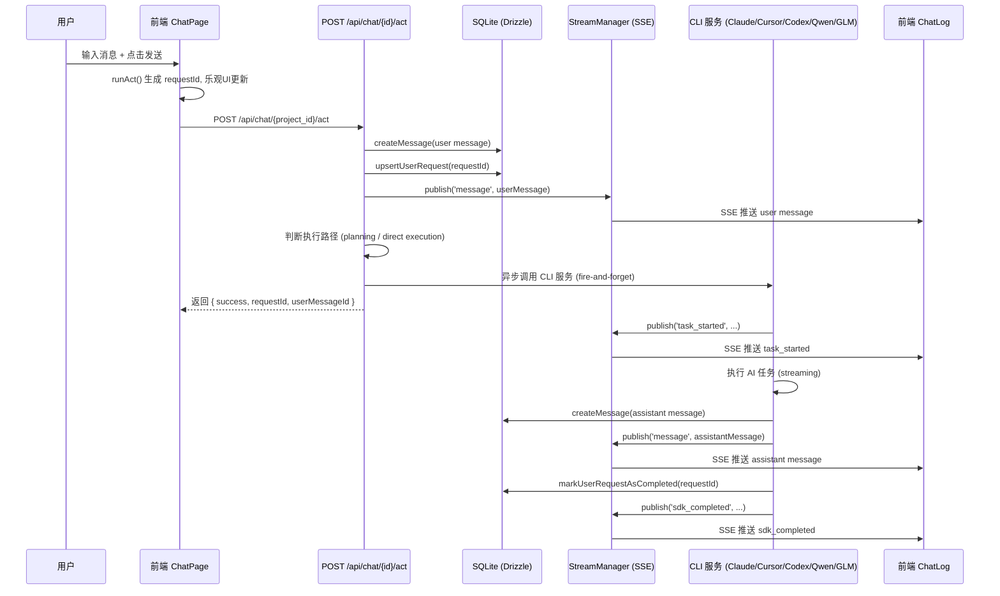
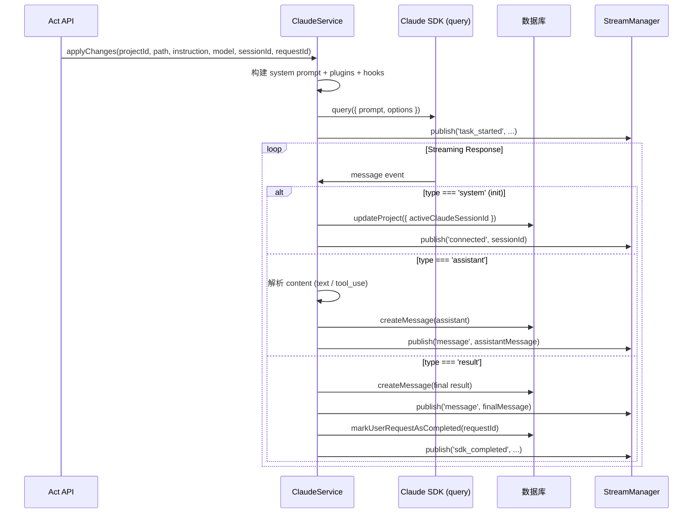
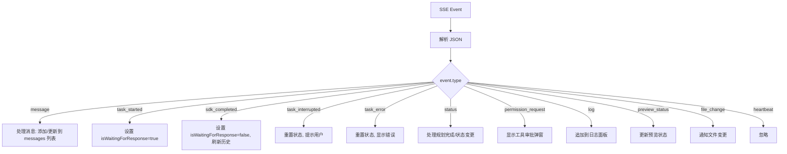
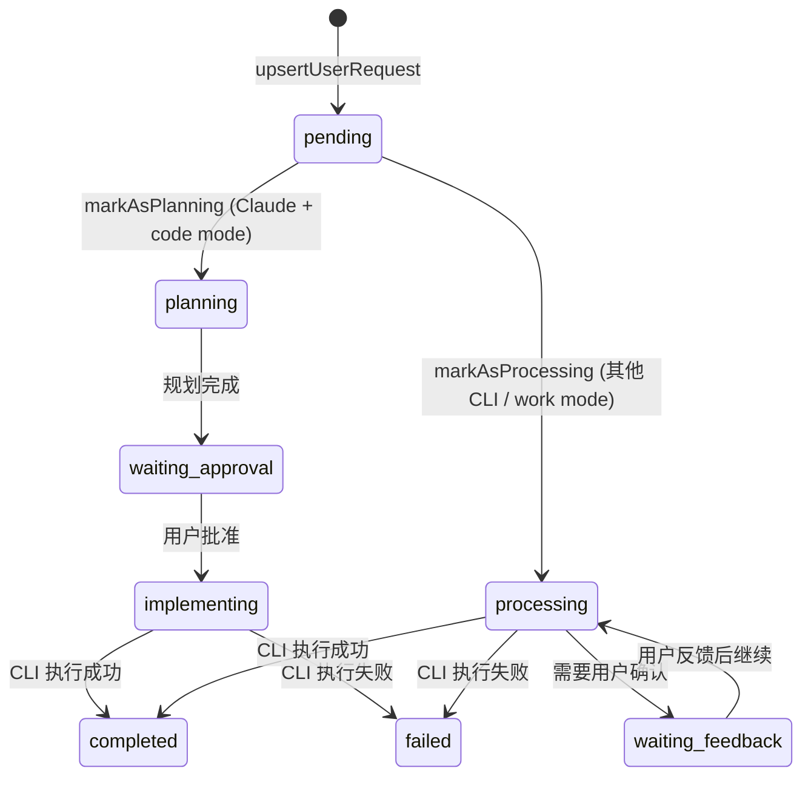
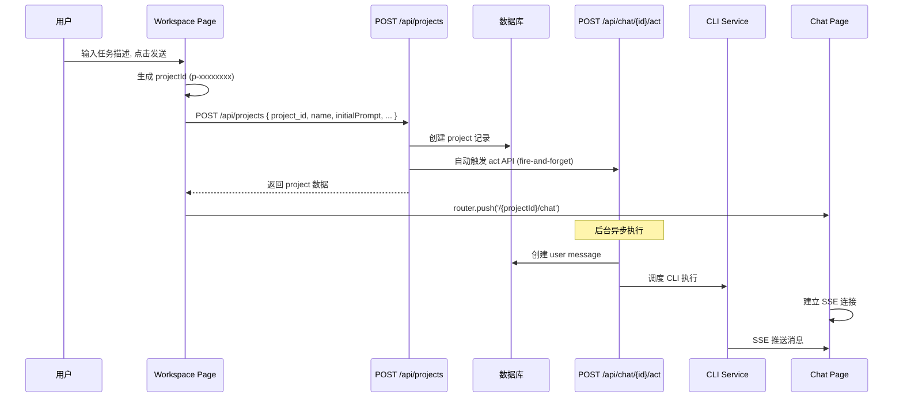

# Project 会话执行流程

## 概览

Project 会话执行是系统的核心交互路径，完整链路为：

**用户输入 → 前端 ChatPage → POST /api/chat/[project_id]/act → 消息持久化 → CLI 服务调度 → SSE 实时推送 → 前端 ChatLog 渲染**

---

## 1. 整体架构



---

## 2. 前端发送消息

### 2.1 入口：ChatPage.runAct()

**文件**: `app/[project_id]/chat/page.tsx`

核心步骤：

1. **去重检查** — 生成请求指纹 (message + imageCount + cli + model)，通过 `pendingRequestsRef` 防止重复发送
2. **生成 requestId** — 前端生成 UUID 作为请求标识
3. **乐观 UI 更新** — 在 API 响应前先将用户消息插入 ChatLog (isOptimistic: true)
4. **图片上传** — 如有图片附件，先通过 `POST /api/assets/{project_id}/upload` 上传
5. **调用 Act API** — `POST /api/chat/{project_id}/act`，携带：
   - `instruction`: 用户输入文本
   - `cliPreference`: CLI 类型 (claude/cursor/codex/qwen/glm)
   - `selectedModel`: 选中的模型 ID
   - `conversationId`: 会话 ID（可选）
   - `requestId`: 前端生成的请求 ID
   - `images`: 图片附件数组
   - `isInitialPrompt`: 是否为项目首次消息
6. **处理响应** — 获取 `conversationId`、`requestId` 更新前端状态

### 2.2 请求体类型定义

**文件**: `types/chat.ts`

```typescript
interface ActRequest {
  instruction: string;
  allowGlobs?: string[];
  conversationId?: string;
  cliPreference?: string;
  fallbackEnabled?: boolean;
  selectedModel?: string;
  images?: ImageAttachment[];
  requestId?: string;
  metadata?: MessageMetadata | null;
}
```

---

## 3. 后端 Act API 处理

### 3.1 路由入口

**文件**: `app/api/chat/[project_id]/act/route.ts`

`POST /api/chat/[project_id]/act` 是项目会话执行的核心入口。

### 3.2 处理流程

```mermaid
flowchart TD
    Start([POST /api/chat/{id}/act]) --> ParseBody[解析请求体]
    ParseBody --> GetProject[查询项目: getProjectById]
    GetProject --> NotFound{项目存在?}
    NotFound -->|否| Return404[404 Not Found]
    NotFound -->|是| NormalizeImages[处理图片附件]
    NormalizeImages --> BuildInstruction[构建最终 instruction]
    BuildInstruction --> ValidateInstruction{instruction 为空?}
    ValidateInstruction -->|是| Return400[400 Bad Request]
    ValidateInstruction -->|否| ResolveCli[解析 CLI 偏好和模型]
    ResolveCli --> CreateUserMsg[创建 user message 到 DB]
    CreateUserMsg --> UpsertRequest[记录 UserRequest 到 DB]
    UpsertRequest --> SetStatus[设置请求状态]
    SetStatus --> PublishMsg[SSE 推送 user message]
    PublishMsg --> UpdateActivity[更新项目活跃时间]
    UpdateActivity --> CheckDemo{匹配演示模式?}
    CheckDemo -->|是| DemoMode[执行演示模式]
    CheckDemo -->|否| ResolveProjectPath[解析项目工作路径]
    ResolveProjectPath --> CheckPlanning{需要规划阶段?}
    CheckPlanning -->|是| GeneratePlan[generateClaudePlan 异步]
    CheckPlanning -->|否| SelectExecutor[选择 executor]
    SelectExecutor --> Execute[executor 异步执行]
    GeneratePlan --> ReturnSuccess[返回 success]
    Execute --> ReturnSuccess
    DemoMode --> ReturnSuccess
```

### 3.3 关键决策分支

#### 项目模式 (mode)
| 模式 | 说明 | 工作路径 | 是否规划 |
|------|------|----------|----------|
| `code` | 编码模式 | `repoPath` (项目目录) | Claude 时需要 |
| `work` | 工作模式 | `work_directory` (用户指定) | 直接执行 |
| `boss` | Boss 模式 | `work_directory` | 直接执行 |
| `cli` | CLI 模式 | 项目路径 | 直接执行 |

#### 是否进入规划阶段
条件：`cliPreference === 'claude' && projectMode === 'code' && planConfirmed !== true`

- **需要规划** → 调用 `generateClaudePlan()`, 状态为 `planning`
- **不需要规划** → 直接调用 executor, 状态为 `processing`

#### Executor 选择逻辑
```
if (isInitialPrompt && mode !== 'work/boss/cli'):
    executor = initializeXxxProject  // 项目初始化函数
else:
    executor = applyXxxChanges       // 变更应用函数
```

支持的 CLI 服务：
| CLI | 初始化函数 | 变更函数 | 文件 |
|-----|-----------|---------|------|
| Claude | `initializeClaudeProject` | `applyClaudeChanges` | `lib/services/cli/claude.ts` |
| Cursor | `initializeCursorProject` | `applyCursorChanges` | `lib/services/cli/cursor.ts` |
| Codex | `initializeCodexProject` | `applyCodexChanges` | `lib/services/cli/codex.ts` |
| Qwen | `initializeQwenProject` | `applyQwenChanges` | `lib/services/cli/qwen.ts` |
| GLM | `initializeGLMProject` | `applyGLMChanges` | `lib/services/cli/glm.ts` |

---

## 4. CLI 服务执行 (以 Claude 为例)

### 4.1 执行流程

**文件**: `lib/services/cli/claude.ts`



### 4.2 Hook 系统

ClaudeService 使用 SDK Hook 系统实现工具审批和追踪：

- **PreToolUse** — 工具执行前拦截，判断是否需要用户确认
  - 自动批准常用工具 (Bash, Read, Write, Edit 等)
  - 需要用户确认时：通过 SSE 发送 `permission_request` 事件，等待用户响应
- **PostToolUse** — 工具执行后回调，记录工具执行结果
- **PostToolUseFailure** — 工具执行失败回调

### 4.3 消息持久化

每条 AI 消息通过 `createMessage()` 写入数据库，同时通过 `streamManager.publish()` 推送到前端：

```typescript
const saved = await createMessage({
  projectId,
  role: 'assistant',
  messageType: 'chat',
  content,
  metadata,
  cliSource: 'claude',
  requestId,
});

streamManager.publish(projectId, {
  type: 'message',
  data: serializeMessage(saved, { requestId }),
});
```

---

## 5. 实时通信 (SSE)

### 5.1 StreamManager

**文件**: `lib/services/stream.ts`

StreamManager 是 SSE 连接管理的核心组件：

- **单例模式** — 全局唯一实例，挂载在 `globalThis` 上确保 HMR 稳定
- **按项目分组** — `Map<projectId, Set<Controller>>` 管理连接
- **广播模式** — 向指定项目的所有客户端推送事件
- **自动清理** — 发送失败的连接自动移除

### 5.2 SSE 端点

**文件**: `app/api/chat/[project_id]/stream/route.ts`

`GET /api/chat/[project_id]/stream` — 客户端建立 SSE 连接

连接建立后自动推送：
1. `connected` — 连接确认
2. `preview_status` — 当前预览状态
3. `request_status` — 活跃请求状态
4. `task_started` — 当前进行中的任务 (多窗口同步)
5. 每 30 秒心跳 `heartbeat`

### 5.3 SSE 事件类型

| 事件类型 | 说明 | 触发时机 |
|----------|------|----------|
| `connected` | 连接建立/会话初始化 | SSE 连接、SDK 会话初始化 |
| `message` | 消息推送 | 用户/助手消息创建 |
| `task_started` | 任务开始 | CLI 开始执行 |
| `sdk_completed` | 任务完成 | CLI 执行完成 |
| `task_interrupted` | 任务中断 | 用户中断任务 |
| `task_error` | 任务错误 | CLI 执行失败 |
| `status` | 状态变更 | 规划完成、各阶段变更 |
| `log` | 日志推送 | CLI stderr 输出 |
| `permission_request` | 工具审批请求 | 需要用户确认的工具调用 |
| `preview_status` | 预览状态 | 预览启动/停止 |
| `file_change` | 文件变更 | CLI 写入/编辑文件 |
| `heartbeat` | 心跳 | 每 30 秒 |

---

## 6. 前端消息接收与渲染

### 6.1 ChatLog 组件

**文件**: `components/chat/ChatLog.tsx`

ChatLog 组件负责：

1. **建立 SSE 连接** — 通过 `EventSource` 连接到 `/api/chat/{project_id}/stream`
2. **处理实时事件** — `handleRealtimeEnvelope()` 分发不同类型的事件
3. **消息渲染** — 维护 `messages` 状态，实时渲染消息列表
4. **会话状态管理** — 跟踪活跃会话、等待响应、规划模式等状态

### 6.2 事件处理



---

## 7. UserRequest 生命周期

### 7.1 状态流转

**文件**: `lib/services/user-requests.ts`



### 7.2 状态枚举

```typescript
type UserRequestStatus =
  | 'pending'
  | 'processing'
  | 'planning'
  | 'waiting_approval'
  | 'implementing'
  | 'active'
  | 'running'
  | 'waiting_feedback'
  | 'completed'
  | 'failed';
```

---

## 8. 辅助 API 端点

| 端点 | 方法 | 说明 |
|------|------|------|
| `/api/chat/[project_id]/messages` | GET | 获取消息历史 (分页) |
| `/api/chat/[project_id]/messages` | POST | 创建消息 (系统/用户日志) |
| `/api/chat/[project_id]/stream` | GET | SSE 实时流连接 |
| `/api/chat/[project_id]/active-session` | GET | 获取活跃会话状态 |
| `/api/chat/[project_id]/sessions/[session_id]/status` | GET | 查询会话状态 |
| `/api/chat/[project_id]/pending-plan` | GET | 获取待审批的计划 |
| `/api/chat/[project_id]/approve-plan` | POST | 批准/拒绝计划 |
| `/api/chat/[project_id]/interrupt` | POST | 中断正在执行的任务 |
| `/api/chat/[project_id]/cli-preference` | PUT | 更新 CLI 偏好 |

---

## 9. 项目创建 → 首次对话的完整链路



---

## 10. 数据流关键文件索引

| 层级 | 文件 | 职责 |
|------|------|------|
| **前端页面** | `app/[project_id]/chat/page.tsx` | ChatPage 主组件，消息发送入口 |
| **前端渲染** | `components/chat/ChatLog.tsx` | 消息列表渲染，SSE 事件处理 |
| **API 路由** | `app/api/chat/[project_id]/act/route.ts` | Act API 主入口 |
| **API 路由** | `app/api/chat/[project_id]/stream/route.ts` | SSE 流端点 |
| **API 路由** | `app/api/chat/[project_id]/messages/route.ts` | 消息 CRUD |
| **API 路由** | `app/api/projects/route.ts` | 项目创建 |
| **CLI 服务** | `lib/services/cli/claude.ts` | Claude SDK 调用 |
| **CLI 服务** | `lib/services/cli/cursor.ts` | Cursor CLI 调用 |
| **CLI 服务** | `lib/services/cli/codex.ts` | Codex CLI 调用 |
| **消息服务** | `lib/services/message.ts` | 消息 CRUD 操作 |
| **流管理** | `lib/services/stream.ts` | SSE 连接管理与事件广播 |
| **请求跟踪** | `lib/services/user-requests.ts` | UserRequest 状态管理 |
| **项目服务** | `lib/services/project.ts` | 项目 CRUD |
| **序列化** | `lib/serializers/chat.ts` | 消息序列化 |
| **类型定义** | `types/chat.ts` | 聊天相关类型 |
| **类型定义** | `types/realtime.ts` | 实时事件类型 |
